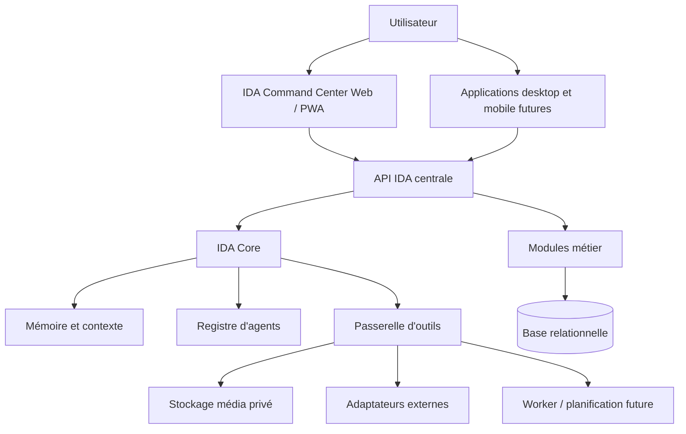

# IDA — Architecture de référence

## 1. Objet et périmètre

IDA (Intelligent Digital Assistant) est conçu comme un **AI Command Center personnel**. Son premier domaine est l'écosystème musical et éditorial de son propriétaire : catalogue, médias, releases, contenu social, campagnes, calendrier, tâches, statistiques et mémoire artistique.

IDA n'est pas un simple outil de publication. Son rôle est de comprendre une demande, la replacer dans un contexte fiable, proposer ou exécuter une action autorisée, conserver un historique explicable, puis rendre le résultat dans une même expérience conversationnelle.

Cette architecture prépare l'ajout progressif de domaines personnels supplémentaires — notamment budget, banque et courses — sans les implémenter dans le MVP ni donner à l'IA un accès implicite à des données ou actions sensibles.

## 2. Principes directeurs

1. **Un cerveau central, plusieurs interfaces.** Le web desktop, la PWA mobile et les futures applications natives utilisent la même API, les mêmes données, les mêmes conversations et la même mémoire.
2. **Monolithe modulaire avant microservices.** Une seule application serveur déployable contient des modules métier clairement séparés. Les frontières de module permettent une extraction ultérieure si une charge ou une intégration le justifie.
3. **API-first.** L'API est le contrat stable entre tous les clients et services internes. Aucune règle métier importante ne vit seulement dans une interface.
4. **L'IA est un orchestrateur, pas une autorité.** Un modèle produit une intention et un plan structurés ; l'application applique les permissions, validations, contraintes métier et appels externes.
5. **Humain dans la boucle.** Le MVP ne publie jamais publiquement sans validation humaine explicite. Les domaines à risque élevé, dont la banque, conservent cette règle renforcée.
6. **Données factuelles séparées des inférences.** Le catalogue, les médias, les analytics et les actions sont des faits tracés. Les suggestions IA, raisonnements et résumés restent des artefacts versionnés et auditables.
7. **Extensibilité intentionnelle, pas complexité prématurée.** Les contrats de modules, agents et outils sont préparés dès maintenant ; les domaines non nécessaires restent absents du produit et de la base active.

## 3. Vue d'ensemble



### 3.1 Couches

| Couche | Rôle | Ne doit pas faire |
|---|---|---|
| Clients | Afficher, capturer l'intention, présenter les validations et notifications | Contenir des secrets, appeler une API sociale directement ou décider des permissions |
| API | Authentifier, autoriser, exposer les contrats, retourner des états cohérents | Dupliquer les règles entre routes ou contourner les services métier |
| IDA Core | Orchestrer une commande naturelle et produire une réponse explicable | Écrire directement dans la base ou appeler un fournisseur externe sans outil |
| Modules métier | Porter les règles de musique, contenu, campagne, mémoire, etc. | Dépendre d'une interface graphique particulière |
| Agents | Raisonner dans un domaine borné et proposer un plan structuré | Posséder des tokens, publier ou supprimer sans policy |
| Passerelle d'outils | Valider, autoriser, journaliser et exécuter les actions | Interpréter librement du texte non structuré |
| Adaptateurs | Isoler les APIs sociales, IA, stockage et services futurs | Exposer leur détail technique au reste du domaine |
| Données et jobs | Conserver les faits, traiter les tâches asynchrones et les événements | Détenir une logique de décision IA opaque |

## 4. Clients : desktop, mobile et voix

### 4.1 Web et PWA au MVP

Le premier client est une application web responsive servant à la fois de hub desktop et mobile : même compte, même session, même conversation et même état système. La couche installable PWA viendra lorsqu’elle apportera un bénéfice concret (offline, notifications ou accès mobile) sans créer de logique métier parallèle.

- Sur desktop : navigation complète `HOME`, `IDA`, `MUSIC`, `CONTENT`, `SOCIAL`, `CALENDAR`, `CAMPAIGNS`, `ANALYTICS`, `TASKS`, `MEMORY`, `SYSTEM`.
- Sur mobile : parcours resserré `HOME`, `IDA`, `CONTENT`, `CALENDAR`, `MORE`.
- Les écrans peuvent présenter différemment une même ressource, mais n'en créent jamais une version métier parallèle.

### 4.2 Applications natives futures

Une future application desktop native ou iPhone native consommera l'API versionnée et les contrats partagés. Elle ne créera ni base locale autoritaire ni « cerveau mobile » séparé. Un cache local, si nécessaire, sera explicitement synchronisé et réconcilié avec le backend central.

### 4.3 Voix

La voix est une interface d'entrée et de sortie au-dessus de la même commande IDA :

```text
Microphone → speech-to-text → /ida/commands → IDA Core
→ réponse structurée → text-to-speech → utilisateur
```

Le MVP prévoit un déclenchement volontaire par bouton. L'écoute permanente, le mot d'activation et les permissions micro avancées sont des sujets ultérieurs ; ils ne modifient pas le modèle de commande ni les contrôles d'autorisation.

## 5. Monolithe modulaire API-first

### 5.1 Pourquoi ce choix

IDA commence avec un seul déploiement serveur et une base relationnelle commune. Cela réduit le coût de développement, les dépendances opérationnelles, les synchronisations distribuées et les risques de cohérence. La modularité est imposée par les contrats et les règles d'accès, pas par des processus réseau prématurés.

Chaque module possède :

- son vocabulaire métier et ses états ;
- ses services applicatifs ;
- ses validations et politiques ;
- ses repositories ou ports de persistance ;
- ses événements de domaine publiés ;
- ses contrats API publics ;
- ses tests propres.

Un module ne lit ni ne modifie les tables d'un autre module en contournant son service public. Les dépendances entre modules passent par contrats, identifiants et événements internes versionnés.

### 5.2 Modules initiaux

| Module | Responsabilité initiale |
|---|---|
| Identity & Workspace | Utilisateurs, espace personnel, session, rôle et fuseau horaire |
| Artist Brain | Profil artistique, projets, ton, objectifs, règles éditoriales |
| Music Brain | Tracks, releases, démos, masters, métadonnées et relations musicales |
| Content Library | Médias, uploads, hash, tags, prévisualisations et usage |
| Conversation & Commands | Conversations, messages, commandes, résultats et historique |
| IDA Core | Routage d'intention, contexte, sélection d'agents et orchestration |
| Content Operations | Posts, variantes, plans, fraîcheur et Approval Center |
| Calendar & Tasks | Échéances, calendrier éditorial, conflits et tâches |
| Campaigns | Objectifs, piliers, plans de campagne et rattachements de contenu |
| Social Integrations | Comptes, capacités, OAuth, livraisons et analytics par plateforme |
| System & Audit | État des intégrations, événements, journal d'activité et erreurs |

Les modules `Analytics` et `Notifications` peuvent naître séparément lorsque leurs premiers flux réels existent. Avant cela, ils restent des contrats et des événements, pas une infrastructure inutile.

### 5.3 Structure cible du dépôt

```text
apps/
  web/                       # Command Center responsive / PWA
  api/                       # Monolithe modulaire, API et IDA Core
  worker/                    # Créé avec les tâches asynchrones réelles
packages/
  contracts/                 # Schémas, DTO et client typé partagés
  domain/                    # Types et règles transverses stables
  db/                        # Schéma relationnel et migrations
  ui/                        # Composants du design system IDA
  config/                    # Configuration non secrète
docs/
  adr/                       # Décisions d'architecture datées
infra/                       # Déploiement et configurations d'environnement
scripts/                     # Scripts de maintenance explicitement nécessaires
tests/                       # Tests transverses et E2E
```

Cette structure est une cible de création progressive. Aucun dossier ni package n'est ajouté tant qu'il ne soutient pas une fonctionnalité validée.

### 5.4 Tranche réellement implémentée — Phase 1 locale

La première tranche conserve volontairement un périmètre réduit et vérifiable :

- `apps/web` est un Command Center React/Vite responsive. Il affiche les onze modules initiaux sur desktop et le parcours `HOME`, `IDA`, `CONTENT`, `CALENDAR`, `MORE` sur mobile ; tous restent des vues du même backend.
- `apps/api` est un monolithe Fastify/TypeScript. Il fournit une identité de démonstration fixée côté serveur, les ressources musicales/de contenu de démonstration et une commande IDA déterministe en lecture seule.
- `packages/contracts` porte les schémas de transport validés et `packages/domain` le registre de modules et la politique d’outils. Le noyau n’autorise pas une opération `PUBLISH` sans approbation explicite.
- L’Artist Brain est désormais éditable dans le workspace local : la mise à jour passe par un schéma strict, un outil interne `WRITE` allowlisté et une migration additive. Elle ne déclenche ni IA, ni connexion, ni publication.
- Le Music Brain permet désormais l’ajout local borné d’un morceau : le serveur résout workspace, projet et acteur, génère l’identifiant, valide les métadonnées, appelle l’outil `create_track` (`MUSIC` / `WRITE`) et ajoute un audit `track.created`. Il n’associe encore ni release, ni média, ni service externe.
- La Content Library accepte désormais l’import local privé d’un fichier : limites, whitelist MIME/extension, hash SHA-256, déduplication par workspace, stockage à clé générée, tags normalisés et audit `media.imported`. Aucun chemin, URL publique, upload cloud ou analyse IA n’est exposé ; scan de signature, quarantaine et dérivés restent des prérequis de production.
- Le Memory Consent Center crée des préférences uniquement sous forme de propositions `PENDING`. Seule une décision humaine explicite peut les confirmer ou les refuser ; la transition est atomique, finale et auditée sans recopier le contenu libre de la préférence.
- Le Task Center crée des tâches internes `TODO` avec échéance facultative et permet une clôture explicite `TODO|IN_PROGRESS → DONE`. Les actions passent par `TASKS` / `WRITE`, sont auditables, isolées par workspace et idempotentes lorsqu’une clôture est rejouée.
- L’Approval Center affiche uniquement les propositions `REQUESTED` du workspace et décide une version éditoriale liée à un hash SHA-256. La route résout la précondition et l’acteur côté serveur, passe par `CONTENT` / `APPROVAL_REQUIRED` et audite la décision sans recopier caption, hashtags ni métadonnées privées. Cette décision conserve `delivery_state = NOT_CONFIGURED` : elle ne touche ni `scheduled_posts`, ni les médias, ni un connecteur social.
- PGlite est employé uniquement comme base locale de développement et de tests. PostgreSQL centralisé, migrations de production, stockage objet et fournisseur d’identité restent des décisions de la suite de Phase 1.
- Les écrans Social et System rendent visibles les capacités et indisponibilités actuelles. Aucun OAuth, token, scraping, appel social ou publication n’est présent dans cette tranche.

Cette implémentation prouve le flux partagé web → API → contrat → données. Elle n’est pas encore une bêta avec données personnelles.

## 6. IDA Core

IDA Core est l'orchestrateur de commandes, et non un agent monolithique. Il transforme une demande utilisateur en exécution contrôlée.

```text
Utilisateur
  → normalisation de la commande
  → détection d'intention et extraction structurée
  → chargement du contexte autorisé
  → consultation de la mémoire pertinente
  → sélection d'agent(s)
  → plan d'action structuré
  → policy et demande d'approbation si nécessaire
  → appel d'outil(s)
  → persistance des faits et logs
  → réponse, sources et prochaine action proposée
```

### 6.1 Contrat de commande

Chaque commande crée un `CommandRun` identifiable et idempotent. Son état explicite peut être :

```text
RECEIVED → UNDERSTOOD → PLANNED → AWAITING_APPROVAL
→ EXECUTING → COMPLETED | FAILED | CANCELLED
```

Une réponse comprend, lorsque c'est utile : le résultat, les ressources concernées, l'agent ou l'outil utilisé, les limites connues, les actions nécessitant une validation et une explication courte du raisonnement. Les pensées internes détaillées du modèle ne sont pas exposées ni utilisées comme données de vérité.

### 6.2 Contexte

Le contexte est construit à la demande et selon les permissions. Il peut inclure :

- le profil artistique et les règles éditoriales actives ;
- les releases, tracks et médias liés à la demande ;
- le calendrier et les tâches pertinentes ;
- l'historique récent d'utilisation ou de publication ;
- les capacités réelles des comptes sociaux connectés ;
- les préférences confirmées de l'utilisateur.

Le contexte doit être borné, traçable et minimal : charger « tout ce qu'IDA sait » pour chaque demande est coûteux, peu fiable et augmente les risques de divulgation de données.

## 7. Agents spécialisés et registre d'agents

### 7.1 Rôle des agents

Un agent est un module de raisonnement spécialisé. Il reçoit un objectif, un contexte autorisé et une liste d'outils permis. Il retourne un plan ou une proposition structurée, jamais un appel externe direct.

Les premiers agents prévus sont :

- `Memory Manager` ;
- `Music Librarian` ;
- `Content Manager` ;
- `Content Curator` ;
- `Copywriter` ;
- `Calendar Manager` ;
- `Campaign Manager` ;
- `Analytics Agent` ;
- `System Agent`.

Ils sont introduits seulement lorsque leur module métier et leurs tests sont prêts. IDA Core peut composer plusieurs agents pour une commande, avec un propriétaire de résultat clairement désigné.

### 7.2 Agent Registry

Le registre d'agents permet d'ajouter régulièrement de nouvelles capacités sans modifier le noyau d'orchestration. Chaque entrée déclare au minimum :

| Élément | Description |
|---|---|
| Identifiant et version | Nom stable, version et statut expérimental/actif/désactivé |
| Domaine | Module propriétaire et limites de responsabilité |
| Intentions prises en charge | Types de demandes que l'agent accepte ou refuse |
| Schéma d'entrée/sortie | Données validées, résultat structuré et erreurs attendues |
| Outils autorisés | Liste blanche de capacités, avec niveau de permission requis |
| Sources de contexte | Données auxquelles l'agent peut accéder, par catégorie |
| Policy | Actions interdites, confirmations nécessaires et budgets éventuels |
| Observabilité | Logs, métriques de succès, version du prompt et traces d'erreur |

Un nouvel agent mensuel suit ce cycle : définition d'un domaine limité, contrat validé, mode lecture/proposition, tests et journalisation, puis extension progressive de ses permissions après validation humaine. Un agent ne devient jamais une porte d'accès générale à toutes les données ou tous les outils.

## 8. Passerelle d'outils et permissions

Les outils internes représentent les capacités d'IDA : rechercher un média, créer une variante de post, consulter le calendrier, demander une connexion sociale, planifier une action, etc.

Tout outil déclare :

- un schéma d'entrée et de sortie validable ;
- un propriétaire métier ;
- un niveau de permission ;
- une règle de validation ou confirmation ;
- un comportement idempotent lorsque la mutation peut être répétée ;
- une stratégie d'erreur ;
- des logs d'audit sans secret.

Les niveaux sont : `READ`, `WRITE`, `APPROVAL_REQUIRED`, `PUBLISH`, `SYSTEM`.

Les outils `PUBLISH` restent sous confirmation humaine explicite dans le MVP. Un outil n'accède à un adaptateur externe qu'après autorisation de la passerelle. Ainsi, l'IA ne reçoit ni tokens OAuth, ni identifiants de stockage, ni capacité cachée de publication.

## 9. Mémoire et connaissances

### 9.1 Catégories

| Catégorie | Contenu | Gouvernance |
|---|---|---|
| Artist Memory | Identité, genres, ton, objectifs et règles éditoriales | Éditable dans l'interface ; source fiable prioritaire |
| Music / Content Memory | Faits issus du catalogue et de la bibliothèque | Alimentée par les opérations métier ; corrigible |
| Campaign / Social Memory | Historique de campagnes, publications et performances | Issue de données synchronisées ou validées |
| Preference Memory | Préférences durables, par exemple captions courtes | Proposition explicite, acceptation ou refus utilisateur |
| System Memory | Informations sur les intégrations et incidents | Créée par le système, auditée et limitée |
| Conversation History | Messages et contexte temporaire | Non promu automatiquement en mémoire durable |

### 9.2 Politique de mémoire

IDA ne transforme pas automatiquement une conversation en préférence permanente. Quand une préférence est détectée, IDA propose son enregistrement, explique son effet, puis conserve la décision de l'utilisateur. Toute mémoire durable est attribuée, datée, modifiable et supprimable selon les règles de rétention.

## 10. Données, événements et extensibilité

La base relationnelle est la source de vérité des entités métier. Les médias binaires résident dans un stockage privé ; la base garde leurs métadonnées, hash, relations et états.

Chaque ressource métier porte un espace propriétaire (`workspace`) dès l'origine. Cette décision permet à terme d'introduire label, collaborateurs, délégation et isolation des données, tout en conservant l'usage personnel simple aujourd'hui.

Les modules peuvent publier des événements internes, par exemple : `media.uploaded`, `post.approved`, `social.token_expired`, `campaign.completed`. Un mécanisme d'outbox persistant sera ajouté avec les premières intégrations asynchrones afin d'éviter les effets partiels. Les consommateurs restent idempotents.

## 11. Intégrations externes

Chaque fournisseur est caché derrière un adaptateur :

- `AIProvider` pour la génération, transcription ou synthèse vocale futures ;
- `StorageProvider` pour les médias ;
- `SocialPlatformAdapter` par plateforme ;
- `CalendarProvider` lorsque le calendrier personnel est intégré ;
- `NotificationProvider` lorsque les notifications sont activées.

Un `SocialPlatformAdapter` déclare ses capacités réelles : OAuth, brouillon, publication, planification native, analytics, webhooks, limites, révision d'application et confirmation humaine requise. Le produit n'invente jamais une capacité que l'API officielle ne garantit pas.

## 12. Futurs domaines : préparés, non implémentés

### 12.1 Finance et banque

IDA doit pouvoir accueillir à terme un module `Finance`, distinct du noyau musical. Il pourrait regrouper budget, catégories de dépenses, objectifs, échéances, comptes et import de transactions via un prestataire autorisé.

Ce module n'est **pas** inclus dans le MVP : aucune connexion bancaire, aucun import de transaction, aucun conseil financier, aucune initiation de paiement et aucune donnée bancaire ne doivent être créés maintenant.

Préparations architecturales uniquement :

- l'espace propriétaire, le registre d'agents, la passerelle d'outils et les permissions permettent un module isolé ;
- les futurs agrégateurs bancaires seront des adaptateurs dédiés, jamais appelés depuis le client ;
- les données financières seront séparées logiquement, chiffrées selon leur sensibilité et soumises à une politique de consentement et rétention spécifique ;
- les actions financières resteront lecture/proposition par défaut, avec confirmation explicite et audit renforcé ;
- l'intégration ne débutera qu'après étude des exigences réglementaires, des pays concernés et de la documentation officielle du fournisseur retenu.

### 12.2 Courses et inventaire domestique

Un futur module `Groceries` pourra gérer listes de courses, articles, catégories, préférences, stocks optionnels, recettes ou propositions de réassort. Il est séparé des données artistiques et financières, mais peut partager le même utilisateur, système de tâches, notifications et interface de commande.

Il n'est **pas** inclus dans le MVP : pas de liste, catalogue produit, commande e-commerce ni intégration commerçante à créer maintenant. Le futur agent associé commencera en lecture/proposition et n'obtiendra une capacité d'achat qu'après conception spécifique, connecteurs autorisés et confirmation explicite par commande.

### 12.3 Règle d'ajout de domaine

Chaque nouveau domaine personnel doit être ajouté comme un module indépendant avec : modèle de données, permissions, registre d'outils, agent dédié facultatif, politiques de rétention, audit et écrans propres. Il peut réutiliser le noyau (`Identity`, `Conversation`, `Tasks`, `Notifications`, `ActivityLog`) sans réutiliser indûment les données sensibles d'un autre domaine.

## 13. Sécurité et exploitation

Les détails sont documentés dans `SECURITY.md`. Les invariants architecturaux sont :

- secrets et tokens exclusivement côté serveur, chiffrés au repos lorsque pertinent ;
- autorisation vérifiée côté serveur pour chaque ressource, outil et intégration ;
- validation des fichiers, URLs signées courtes et stockage média privé ;
- journaux d'audit pour commandes, approbations, outils et événements système ;
- séparation stricte entre développement et production ;
- sauvegardes, restauration testée et politique de rétention ;
- limites de débit pour authentification, upload, commandes IA et intégrations ;
- aucun contenu confidentiel ajouté par défaut aux prompts IA.

## 14. Décisions à conserver

| Décision | Motivation |
|---|---|
| PWA unique au MVP | Répond au desktop et iPhone avec un backend unique et un coût maîtrisé |
| Monolithe modulaire | Accélère l'itération tout en protégeant les frontières métier |
| API versionnée | Prépare les clients natifs et les nouveaux modules |
| Base relationnelle + stockage objet | Convient aux relations musicales et à la gestion de médias |
| Agents enregistrés et bornés | Permet d'ajouter un agent mensuel sans créer un agent omniscient |
| Tool Gateway obligatoire | Empêche une sortie IA de devenir une action non contrôlée |
| Mémoire confirmable | Préserve le contrôle de l'utilisateur sur les préférences durables |
| Finance et courses différées | Prépare le hub complet sans étendre inutilement le MVP ni augmenter le risque |

## 15. Frontières du MVP

Le MVP initial construit le socle musical et éditorial : authentification, Artist Brain, Music Brain, bibliothèque de contenus, commande textuelle, propositions, validation humaine et dashboard responsive.

Sont explicitement hors MVP : publication autonome, écoute vocale permanente, applications natives distinctes, connexions bancaires, paiements, achats, automatisations à haut risque, microservices, agents autonomes généraux et tout scraping d'une plateforme disposant d'une API officielle.
